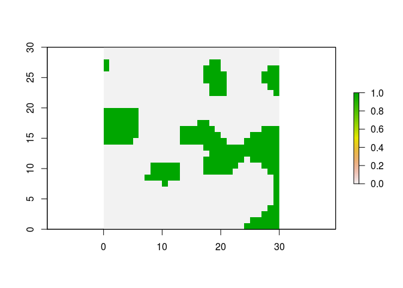
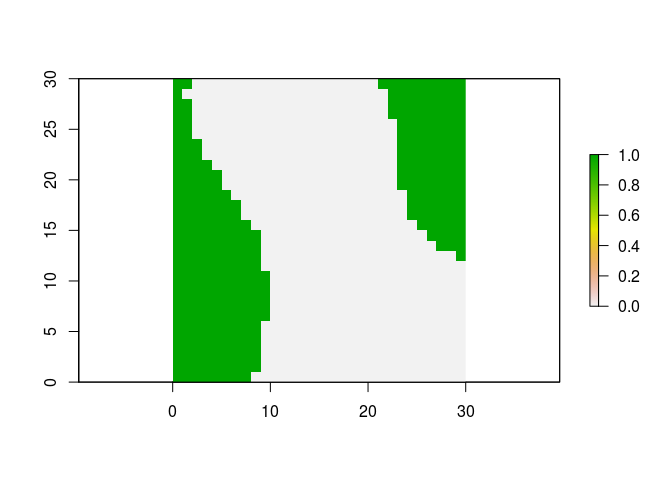
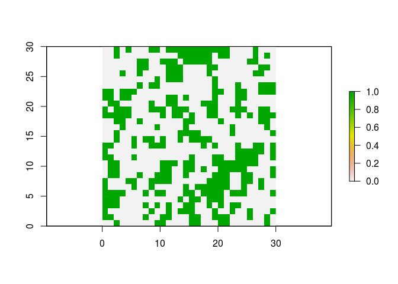
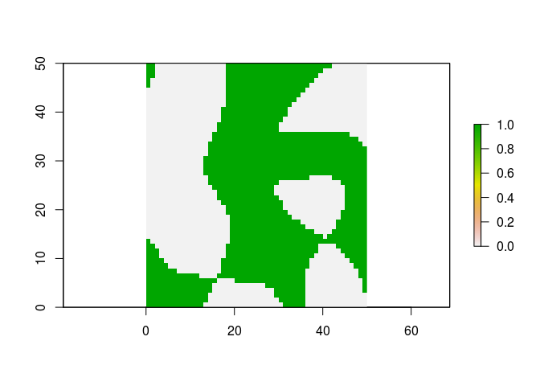
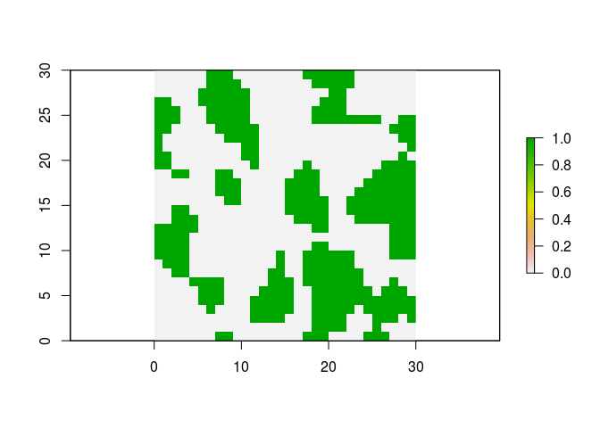

covertest() - a simple tool for training the estimation of vegetation
cover
================
Roman M. Link

## Motivation

After reading an interesting question by [Ekaterina
Petrunenko](https://www.researchgate.net/profile/Ekaterina_Petrunenko)
on
\[ResearchGate\]\[<https://www.researchgate.net/post/Software_for_training_accurate_eye>\],
I realized that I (as well as probably most other field biologists)
often struggled with precise vegetation coverage estimates because in
nature there is no easy way to practice it.

I therefore wrote a small little script (`covertest.R`) that generates
samples of randomly generated vegetation cover, allowing you to improve
your estimation skills.

## How it works

To achieve this, I draw a sample from a multivariate normal distribution
with a Gaussian spatial autocorrelation function with correlation
parameter `delta`. I then randomly sample a proportion from a specified
range (0 - 100 % unless `range` is changed from its original values),
and classify the raster into two groups based on the threshold specified
by the randomly sampled proportion.

This raster is then printed, and the original and classified raster, the
true coverage percentage and the autocorrelation parameter are then
silently returned. A print function is defined that allows to easily
check the true coverage percentage, so it is easy to first look at the
plot, make a guess, and then check the true value.

## Example

The functions in this script rely on the functionalities of the `raster`
package, so do not forget to load (and if necessary install) it before
starting.

``` r
# install raster package if necessary
# install.packages("raster")
library(raster)
```

    ## Loading required package: sp

Then, simply copy the `covertest.R` file from this GitHub project into
your project folder and load it with `source()`.

``` r
source("covertest.R")
```

Now you just have to run the covertest function to get a plot of random
“vegetation cover”.

``` r
# random seed for replicability
set.seed(12345)

# create simulated raster
cover <- covertest(delta = 5, n = 30, range = c(0, 100))
```

<!-- -->

To get the true coverage percentage, simply print the generated object.

``` r
# print to get output 
cover
```

    ## Simulated coverage proportion for a 30 x 30 raster
    ## 
    ## Autocorrelation parameter delta = 5 
    ## 
    ## True coverage percentage: 21.7 %

To practice estimating the vegetation under different conditions, play
around with the delta parameter. Large values of `delta` produce large
areas of contiguous coverage:

``` r
set.seed(56789)
cover1 <- covertest(delta = 20, n = 30, range = c(0, 100))
```

<!-- -->

``` r
cover1
```

    ## Simulated coverage proportion for a 30 x 30 raster
    ## 
    ## Autocorrelation parameter delta = 20 
    ## 
    ## True coverage percentage: 34.6 %

Low values of `delta` lead to more small-scale variability in the
“vegetation cover”.

``` r
set.seed(12321)
cover2 <- covertest(delta = 1, n = 30, range = c(0, 100))
```

<!-- -->

``` r
cover2
```

    ## Simulated coverage proportion for a 30 x 30 raster
    ## 
    ## Autocorrelation parameter delta = 1 
    ## 
    ## True coverage percentage: 36.4 %

Changing `n` changes the number of cells in the analyzed n x n matrix.
Be careful, high values of `n` lead to large computation times\!

``` r
set.seed(23456)
cover2 <- covertest(delta = 10, n = 50, range = c(0, 100))
```

<!-- -->

``` r
cover2
```

    ## Simulated coverage proportion for a 50 x 50 raster
    ## 
    ## Autocorrelation parameter delta = 10 
    ## 
    ## True coverage percentage: 49.6 %

The `range` parameter can be used to set the range of coverage
probabilities. If you use the same value for the lower and upper bound,
you can get simulations for a specific coverage proportion, say 37.6%
(up to rounding errors caused by the finite number of cells):

``` r
set.seed(12321)
cover2 <- covertest(delta = 2.5, n = 30, range = c(37.6, 37.6))
```

<!-- -->

``` r
cover2
```

    ## Simulated coverage proportion for a 30 x 30 raster
    ## 
    ## Autocorrelation parameter delta = 2.5 
    ## 
    ## True coverage percentage: 37.7 %

## Last words

Please enjoy my script, but note that it is just the outcome of a friday
afternoon procrastination session and as such comes without any warranty
whatsoever…
